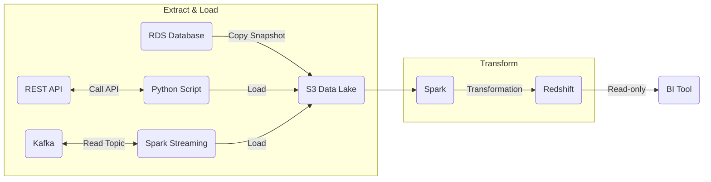
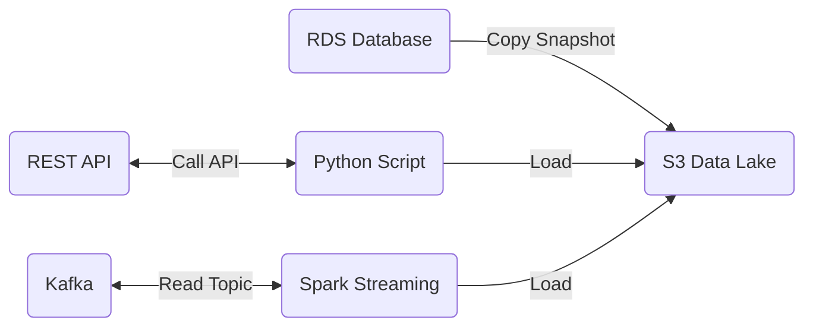
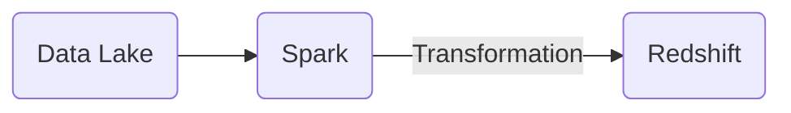

# Cloud Data Platform Architecture

## Tools

Assuming AWS as the cloud provider

- Python script for REST APIs
  - Pair with Lambda, ECS, AWS Batch
- Apache Spark for ingesting stream data and transforming raw data
- Apache Airflow for scheduling and orchestrating Spark jobs
  - Consider managed flow, like AWS MWAA
- S3 for storing raw data in data lake
- Apache Iceberg to query across S3 data lake
- Redshift as the data warehouse
- SQL is used for Trino, Iceberg, and Redshift
- GitLab for version control and CI/CD
- Power BI or Tableau for analysts, but may be analysts tool of choice

## Extract & Load

- AWS RDS can export daily snapshots to S3
  - AWS uses compressed parquet, preferred file format for data engineers
  - Snapshots will likely exist anyway for disaster recovery purposes
- Python script is used to read data from REST APIs
  - Python is the preferred language of the majority of data engineers
  - The script is versatile and platform agnostic (Lambda, ECS Task, AWS Batch)
  - Fine control over logic, testable, but must maintain
- Apache Spark can read events over a window, and store in S3
- S3 is used as a Data Lake to store raw data
  - Data retention policy to move expired data to S3 Glacier or remove
- Apache Iceberg to maintain raw data metadata
- Trino to query across raw data with SQL
- Data Engineers and possibly Data Scientists have access to Data Lake

## Transform

- Transform data from the Data Lake and load into Redshift using Spark
  - Data validation steps included here
- Includes multi-step data pipelines orchestrated by Airflow
- Dimensions, facts, and aggregations stored here

## Data Warehousing

- Various read-only access roles for analysts, data scientists, etc.
- Star schema data modeling with fact tables and their corresponding dimensions

## Analytics

- Power BI or Tableau connect to Redshift to perform analytics, create dashboards, etc.
- Granted necessary access role for their business line
