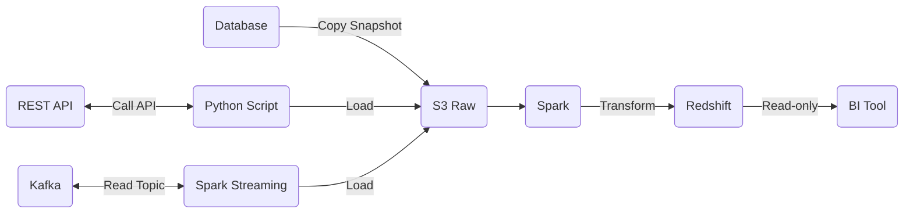

# Cloud Data Platform Architecture

## Tools

Assuming AWS as a cloud provider

- Python script for REST APIs
  - Pair with Lambda, ECS, AWS Batch
- Apache Spark for ingesting stream data and transforming raw data
- S3 for storing raw and data lake data
- Apache Iceberg to query across S3 data lake
- Redshift for storing dimensions, facts, aggregated analytics
- Power BI or Tableau for analysts, but may be analysts tool of choice

## Extract

## Data Lake

## Data Warehouse

## Analytics

- Use a Python script to interact with REST APIs
  - Use API provided SDK or requests library
  - Schedule the task when next day of data available (Airflow or EventBridge)
  - Script allows platform versatility (Lambda, ECS task, AWS Batch)
  - Unit test script
- Export daily snapshots from RDS to S3
  - Snapshots should be available as part of disaster recovery anyway
  - AWS exports in compressed parquet format
- Spark Streaming read from Kafka
  - Batch events with Spark and write to S3 in relatively raw format
